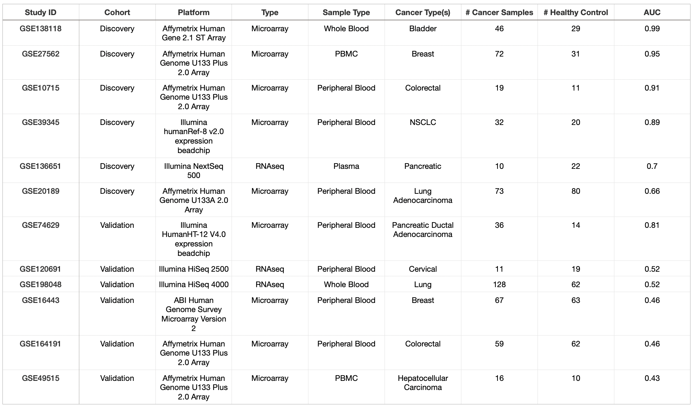
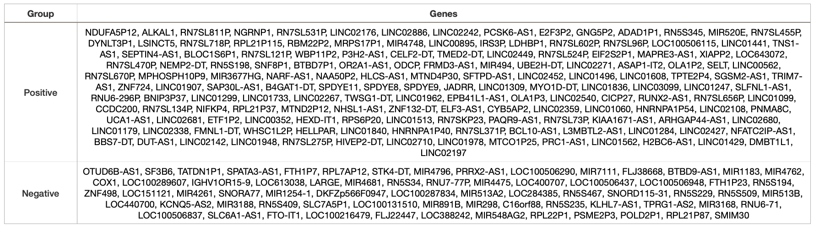
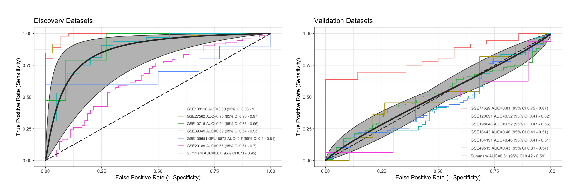

# Identifying Cancer Blood Biomarkers
This project focuses on the identification of blood biomarkers for cancer through a comprehensive meta-analysis of publicly available gene expression datasets. The repository contains essential scripts and data necessary for downloading, pre-processing, and analyzing gene expression data to uncover potential biomarkers that can be used to distinguish between cancerous and healthy samples and/or be used as potential drug targets.    


## Repository Contents
```data_preparation.Rmd``` - Code for downloading, pre-processing, labeling, wrangling the data before meta-analysis.  
```meta_analysis.Rmd``` -  Code for meta-analysis and generating data visualizations.  
```pos_genes.txt```   - Upregualted component genes in 224-gene blood cancer signature  
```neg_genes.txt``` - Downregulated component genes in 224-gene blood cancer signature  

## Methods & Data

### Studies
I manually searched and inspected  microarray and RNAseq studies from the NCBI Gene Expression Omnibus database (GEO) that would be suitible for this analysis. After identifying several dozen potential studies, I narrowed them down to the following 12 and randomly sorted them into discovery and validation (test/train) cohorts. One study was manually selected for validation cohort due to smaller amount of gene coverage (GSE16443, with ~6k genes).  

I only wanted studies with blood samples (either PBMCs, whole blood, peripheral blood, or plasma) and at least 10 cancer samples and 10 healthy controls. I filtered out samples/studies where the condition was unclear. In cases where there were pre/post-treatment, I would only select pre-treatment samples. I also filtered out studies where there was poor coverage of the transcriptome (ie. NanoString studies with only a few hundred to a few thousand genes sampled). 



There was a total of n = 452 samples in the discovery datasets (cancer = 252, control = 200) and n = 547 in the validation datasets (cancer = 317, control = 230).

### Pre-Processing
All metadata was from GEO, and I also used the pre-processed expression data from GEO when possible. For GSE136651 and GSE120691, no expression data was directly available from GEO. For these studies (which were RNAseq studies), I downloaded the FASTQs from the European Nucleotide Archive quantified them using Salmon (https://github.com/hansenrhan/ena_rnaseq_quantification). 

All pre-processing code (labeling samples, filtering samples, matching probes/transcripts with gene names, etc.) is available in ```data_preparation.Rmd```.

### Meta-Analysis
After preparing the studies, meta-analysis was performed using the ```MetaIntegrator``` package in R. 


## Results
### Identified a 224-Gene Cancer Blood Gene Signature
After computing and combining effect-sizes for each gene in cancer vs. healthy controls for each study using ```MetaIntegrator::runMetaAnalysis()```, I identified  a gene signature using ```MetaIntegrator::filterGenes()``` with a criteria of a gene being significant in at least 1 study, having an effect size >= 1, and an FDR <= 0.05.   




### Identified Gene Signature Does Not Generalize to Independent Studies
To explore the diagnostic power of the gene signature classifying cancer and healthy samples, I generated summary ROC curves for each study in the discovery and validation cohorts using ```MetaIntegrator::summaryROCPlot()```. Although the gene signature had overall high classification power in the discovery datasets (summary AUC = 0.87), this broke down in the independent validation datasets (summary AUC = 0.51). Unfortunately, this indicates that the gene signature is overfit for discovery datasets and provides low confidence that the signature contains robust blood biomarkers of cancer. 




## Conclusions & Future Work
Unfortunately, since the identified 224-gene cancer blood signature does not generalize well to independent validation datasets, its current utility is limited. As more studies are published, perhaps in the future, further refinement and validation with larger and more varied datasets may be possible to identify robust biomarkers of cancer in blood samples. These in turn may be used for diagnostic purposes or in identifying potential drug targets. 

While I considered additional analysis such as enrichment analysis of the gene signature and exploring additional expression data from other sample types, such as isolated neutrophils, CD4 cells, and CD8 cells, etc. However, given the discouraging findings in the validation studies, I ultimately decided to move on to other projects.

Additionally, by sharing this project publicly, I hope it can serve as a valuable reference for similar future work.

